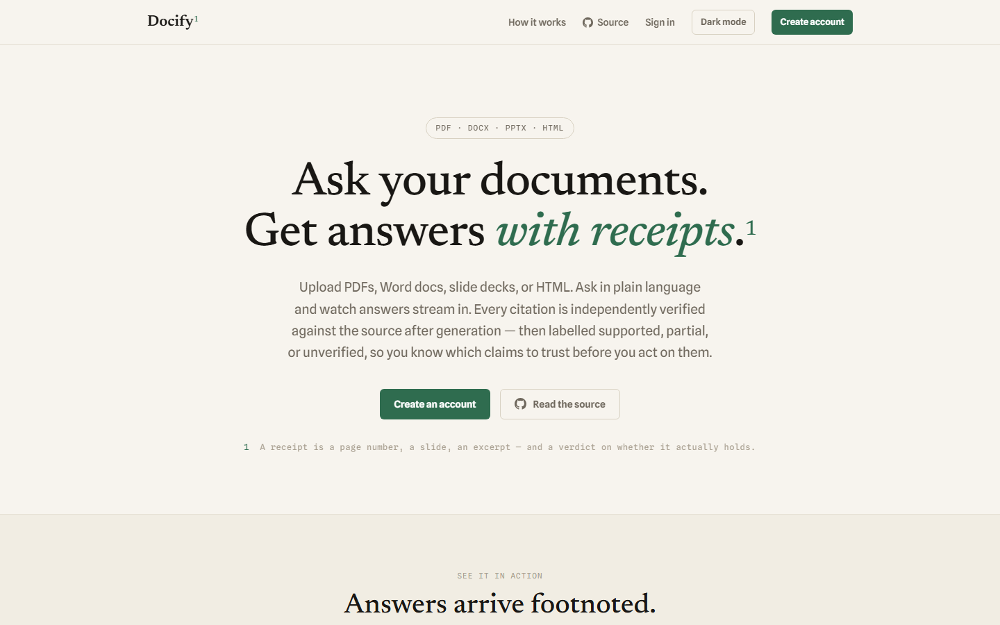
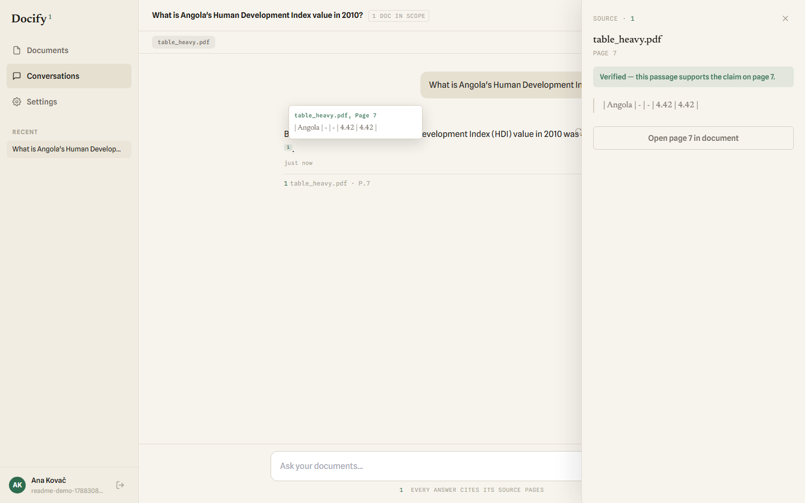
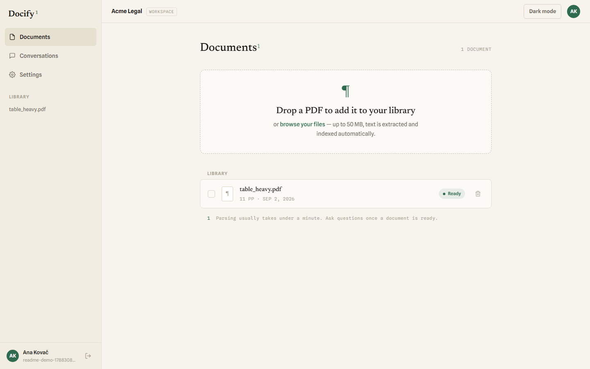

# Docify

**Ask your documents. Get answers with receipts.**

Docify is a multi-tenant document Q&A app. Upload a PDF, Word doc, slide deck, or HTML file, ask a question in plain language, and watch the answer stream in — every citation independently re-checked against the source *after* generation and labelled **supported**, **partial**, or **unverified**, so you know which claims to trust before you act on them.

[**Live demo →**](https://docify-web-steel.vercel.app) · [Architecture](.agent/ARCHITECTURE.md) · [License](LICENSE)



---

## Why "with receipts"

A model asserting its own sources isn't evidence — generation and verification are two separate steps here. Once an answer exists, each citation is re-checked against the exact chunk it names:

| Verdict | Meaning |
|---|---|
| 🟢 **Supported** | The cited passage states the claim. Cite it onward as-is. |
| 🟡 **Partial** | The source backs part of the claim — worth a direct look. |
| ⚪ **Unverified** | The check couldn't confirm it (a real infrastructure failure, not a guess) — shown, not silently dropped. |

Click any citation to open the exact page, slide, or table it came from.



## Features

- **Four formats, one library** — PDF, DOCX, PPTX, HTML. Text, tables, and figures are extracted, chunked, and indexed on upload, with real page/slide boundaries preserved.
- **Streaming answers** — tokens arrive as they're generated, with retrieval and verification happening behind the scenes.
- **Independently verified citations** — every claim is re-checked against its source after the fact, not just asserted by the model.
- **Multi-tenant by design** — every row carries a tenant, enforced at the database via Postgres row-level security, not application code.
- **Resilient embeddings** — Voyage multimodal embeddings with an automatic Gemini fallback (and now, real server-guided retry timing on both) when a provider's rate limit is hit.
- **Full account lifecycle** — profile, avatar, preferences, real data export, and complete account deletion — nothing left behind in any table or storage bucket.



## Tech stack

| Layer | Choice |
|---|---|
| Frontend | Next.js 14 (App Router), Tailwind, deployed on Vercel |
| Backend | FastAPI (Python 3.12), deployed on Render |
| Parsing | [pdfplumber](https://github.com/jsvine/pdfplumber) (PDF), `python-docx`, `python-pptx`, `selectolax` (HTML) |
| Embeddings | Voyage `voyage-multimodal-3.5`, with a Gemini `gemini-embedding-2` fallback |
| Generation & verification | Gemini (`gemini-3.6-flash` / `gemini-3.5-flash-lite`) |
| Database | Supabase (Postgres + pgvector + Auth + Storage), multi-tenant via row-level security |

Full rationale for every decision above lives in [`.agent/MEMORY.md §Decision log`](.agent/MEMORY.md).

## Quick start

### Frontend (`apps/web`)

```bash
cd apps/web
pnpm install
cp .env.example .env.local   # fill in Supabase + API URL values
pnpm dev                     # http://localhost:3000
```

### Backend (`apps/api`)

```bash
cd apps/api
uv sync
cp .env.example .env         # fill in Supabase, Voyage, Gemini keys
uv run uvicorn main:app --reload   # http://localhost:8000
```

Both apps need a real Supabase project (Postgres + pgvector + Auth + Storage) — see [`.agent/SCHEMA.md`](.agent/SCHEMA.md) for the schema and [`apps/api/migrations/`](apps/api/migrations) for every migration, in order.

## Architecture

Docify is a real, deployed monorepo — not a demo running against mocks. See [`.agent/ARCHITECTURE.md`](.agent/ARCHITECTURE.md) for the full system diagram, ingest/query/verify flow, and locked design decisions, and [`AGENT.md`](AGENT.md) for how this project's own development process is organized.

## License

MIT — see [LICENSE](LICENSE).
